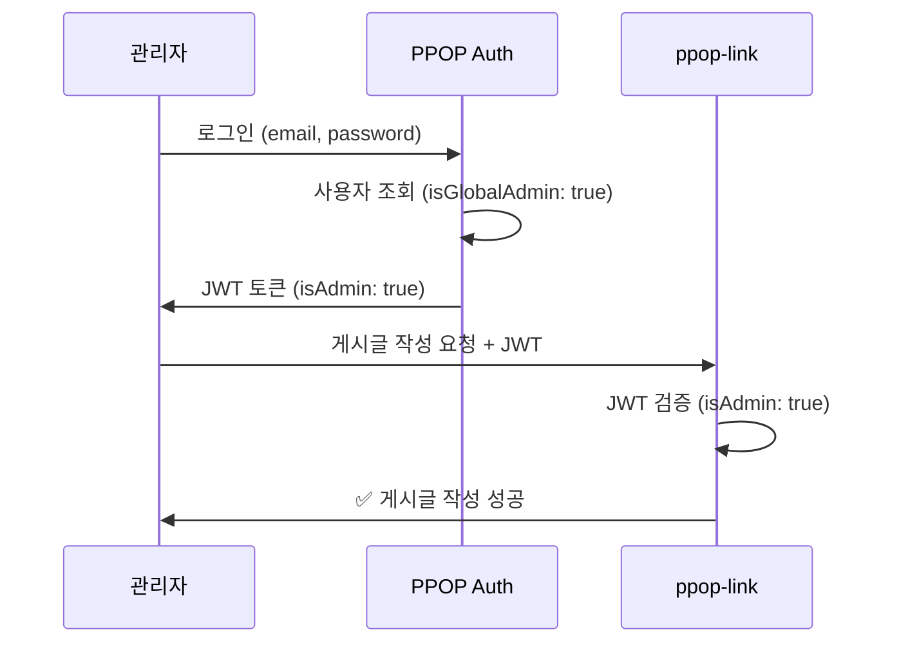

# 통합 관리자 계정 (Global Admin)

## 📋 개요

PPOP Auth의 **통합 관리자 계정**은 모든 연동된 SaaS 서비스(ppop-link, ppop-editor 등)에서 자동으로 관리자 권한을 가지는 특별한 계정입니다.

### 핵심 개념

- **하나의 계정 = 모든 서비스 관리자**
- JWT 토큰에 `isAdmin` 필드 포함
- 각 SaaS는 토큰의 `isAdmin` 값만 확인하면 됨
- 서비스별 권한 관리 불필요

---

## 🏗️ 아키텍처

### 데이터베이스 스키마

```prisma
model User {
  id            String     @id @default(uuid())
  email         String     @unique
  isGlobalAdmin Boolean    @default(false) @map("is_global_admin")
  // ... 기타 필드
  
  @@index([isGlobalAdmin])
}
```

### JWT 토큰 구조

```json
{
  "sub": "user-id",
  "email": "admin@ppop.cloud",
  "type": "access",
  "isAdmin": true,
  "iat": 1234567890,
  "exp": 1234567890
}
```

---

## 🚀 사용 방법

### 1. 초기 관리자 계정 생성

Seed 스크립트를 실행하여 관리자 계정을 생성합니다:

```bash
cd auth-server
npx ts-node prisma/seed.ts
```

**출력 예시:**
```
--- Global Admin User ---
Global Admin User:
  Email: admin@ppop.cloud
  User ID: 6d6ee487-8d14-4de0-985a-2cd06ce685ef
  isGlobalAdmin: true
  Password: ChangeMe123!
```

### 2. 환경변수 설정

`.env` 파일에 관리자 정보를 설정합니다:

```bash
# 관리자 계정 (Seed 스크립트용)
ADMIN_EMAIL=admin@ppop.cloud
ADMIN_PASSWORD=YourSecurePassword123!
```

**환경변수 설명:**
- `ADMIN_EMAIL`: Seed 스크립트로 생성할 관리자 이메일
- `ADMIN_PASSWORD`: 관리자 계정 비밀번호

**관리자 권한:**
- 모든 SaaS 서비스에서 관리자 기능 사용 가능
- 다른 사용자에게 관리자 권한 부여/제거 가능

### 3. 관리자 로그인

일반 로그인 API를 사용합니다:

```bash
POST /api/auth/login
Content-Type: application/json

{
  "email": "admin@ppop.cloud",
  "password": "YourSecurePassword123!"
}
```

**응답:**
```json
{
  "accessToken": "eyJhbGciOiJSUzI1NiIsInR5cCI6IkpXVCJ9...",
  "refreshToken": "eyJhbGciOiJSUzI1NiIsInR5cCI6IkpXVCJ9...",
  "expiresIn": 900,
  "user": {
    "id": "6d6ee487-8d14-4de0-985a-2cd06ce685ef",
    "email": "admin@ppop.cloud",
    "emailVerified": true,
    "createdAt": "2025-12-30T12:00:00.000Z"
  }
}
```

JWT 토큰을 디코딩하면 `isAdmin: true`가 포함되어 있습니다.

---

## 🔧 관리자 관리 API

### 모든 관리자 조회

```bash
GET /api/users/admins
Authorization: Bearer <관리자_토큰>
```

**응답:**
```json
{
  "count": 2,
  "admins": [
    {
      "id": "6d6ee487-8d14-4de0-985a-2cd06ce685ef",
      "email": "admin@ppop.cloud",
      "isGlobalAdmin": true,
      "createdAt": "2025-12-30T12:00:00.000Z"
    },
    {
      "id": "another-user-id",
      "email": "another-admin@example.com",
      "isGlobalAdmin": true,
      "createdAt": "2025-12-30T13:00:00.000Z"
    }
  ]
}
```

### 관리자 권한 부여

```bash
PATCH /api/users/:userId/admin
Authorization: Bearer <관리자_토큰>
Content-Type: application/json

{
  "isAdmin": true
}
```

**응답:**
```json
{
  "message": "Global admin role granted",
  "user": {
    "id": "user-id",
    "email": "user@example.com",
    "isGlobalAdmin": true,
    "createdAt": "2025-12-30T12:00:00.000Z"
  }
}
```

### 관리자 권한 제거

```bash
PATCH /api/users/:userId/admin
Authorization: Bearer <관리자_토큰>
Content-Type: application/json

{
  "isAdmin": false
}
```

---

## 🔐 SaaS 서비스에서 권한 확인

### ppop-link 예시

```typescript
// JWT 토큰 검증 후
const decodedToken = jwt.verify(token, publicKey);

// 관리자 여부 확인
const isAdmin = decodedToken.isAdmin === true;

// 게시글 작성 API
if (isAdmin) {
  // ✅ 관리자 게시글 작성 허용
  await createAdminPost(postData);
} else {
  // ❌ 권한 없음
  throw new ForbiddenException('Admin access required');
}
```

### Express 미들웨어 예시

```typescript
// middleware/checkAdmin.ts
export function checkAdmin(req, res, next) {
  const user = req.user; // JWT 검증 후 설정된 사용자 정보
  
  if (!user || !user.isAdmin) {
    return res.status(403).json({ 
      error: 'Admin access required' 
    });
  }
  
  next();
}

// 사용
app.post('/api/admin/posts', checkAdmin, createPost);
```

### NestJS Guard 예시

```typescript
// guards/admin.guard.ts
import { Injectable, CanActivate, ExecutionContext } from '@nestjs/common';

@Injectable()
export class AdminGuard implements CanActivate {
  canActivate(context: ExecutionContext): boolean {
    const request = context.switchToHttp().getRequest();
    const user = request.user;
    
    return user?.isAdmin === true;
  }
}

// 사용
@Post('admin/posts')
@UseGuards(JwtAuthGuard, AdminGuard)
async createAdminPost(@Body() dto: CreatePostDto) {
  // 관리자만 접근 가능
}
```

---

## 🔒 보안 고려사항

### 1. 관리자 권한

관리자(`isGlobalAdmin: true`)는 다음 권한을 가집니다:
- 모든 SaaS 서비스에서 관리자 기능 사용
- 다른 사용자에게 관리자 권한 부여/제거
- 모든 관리자 목록 조회

**주의:** 관리자는 강력한 권한을 가지므로 신뢰할 수 있는 사용자에게만 부여하세요.

### 2. 환경변수 보안

프로덕션 환경에서는 반드시 안전한 비밀번호를 설정하세요:

```bash
# ❌ 나쁜 예
ADMIN_PASSWORD=ChangeMe123!

# ✅ 좋은 예
ADMIN_PASSWORD=$(openssl rand -base64 32)
```

### 3. 감사 로그 (선택사항)

향후 관리자 권한 변경 이력을 기록하는 감사 로그 기능을 추가할 수 있습니다.

---

## 📊 사용 흐름



---

## 🧪 테스트

### 1. 관리자 로그인 테스트

```bash
# 로그인
curl -X POST http://localhost:3000/api/auth/login \
  -H "Content-Type: application/json" \
  -d '{
    "email": "admin@ppop.cloud",
    "password": "ChangeMe123!"
  }'

# JWT 토큰 디코딩 (https://jwt.io)
# isAdmin: true 확인
```

### 2. 관리자 권한 부여 테스트

```bash
# 관리자로 로그인하여 토큰 획득
ADMIN_TOKEN="eyJhbGciOiJSUzI1NiIsInR5cCI6IkpXVCJ9..."

# 다른 사용자에게 관리자 권한 부여
curl -X PATCH http://localhost:3000/api/users/USER_ID/admin \
  -H "Authorization: Bearer $ADMIN_TOKEN" \
  -H "Content-Type: application/json" \
  -d '{"isAdmin": true}'
```

### 3. ppop-link에서 권한 확인 테스트

```bash
# 관리자 토큰으로 게시글 작성
curl -X POST http://localhost:3002/api/admin/posts \
  -H "Authorization: Bearer $ADMIN_TOKEN" \
  -H "Content-Type: application/json" \
  -d '{
    "title": "관리자 게시글",
    "content": "관리자만 작성 가능"
  }'
```

---

## 🚨 문제 해결

### 관리자 권한이 JWT에 포함되지 않음

**증상:** JWT 토큰에 `isAdmin` 필드가 없거나 `false`

**해결:**
1. 데이터베이스에서 사용자의 `isGlobalAdmin` 확인:
   ```sql
   SELECT id, email, is_global_admin FROM users WHERE email = 'admin@ppop.cloud';
   ```

2. `isGlobalAdmin`이 `false`면 수동으로 업데이트:
   ```sql
   UPDATE users SET is_global_admin = true WHERE email = 'admin@ppop.cloud';
   ```

3. 다시 로그인하여 새 토큰 발급

### 관리자 API 접근 불가

**증상:** `403 Forbidden: Admin access required`

**해결:**
1. 데이터베이스에서 사용자의 `isGlobalAdmin` 확인:
   ```sql
   SELECT id, email, is_global_admin FROM users WHERE email = 'your-email@example.com';
   ```

2. `isGlobalAdmin`이 `false`면 수동으로 업데이트:
   ```sql
   UPDATE users SET is_global_admin = true WHERE email = 'your-email@example.com';
   ```

3. 다시 로그인하여 새 토큰 발급 (JWT에 `isAdmin: true` 포함됨)

---

## 📝 요약

| 항목 | 설명 |
|------|------|
| **필드** | `User.isGlobalAdmin` (Boolean) |
| **JWT 클레임** | `isAdmin` (Boolean) |
| **적용 범위** | 모든 연동된 SaaS 서비스 |
| **관리 방법** | Seed 스크립트 또는 관리자 API |
| **권한** | SaaS 관리 + 다른 사용자 관리자 지정 |

---

## 🔗 관련 문서

- [API 문서](./05_api.md)
- [개발 가이드](./06_dev_guide.md)
- [SaaS 등록 가이드](./07_saas_registration.md)

